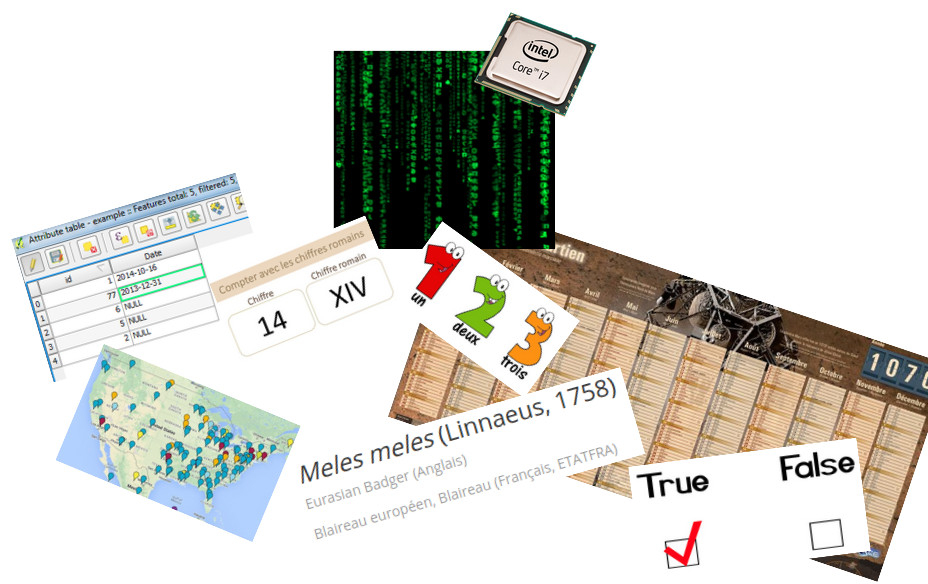

- [Découverte de QGIS](#dcouverte-de-qgis)
  - [Structure des projets](#structure-des-projets)
  - [Ouvrir et explorer des données](#ouvrir-et-explorer-des-donnes)
  - [Mettre en place son environnement de travail](#mettre-en-place-son-environnement-de-travail)

# Un peu de théorie et d'élements de language

## Informations et représentations

Par nature, une information (ou "donnée"), est un concept **abstrait**, qu'on cherche à **représenter** sous différentes formes (tableau, carte, calendrier, etc..) pour **communiquer**.

Sans nécessairement en avoir conscience, on utilise quotidiennement des **normes ou conventions** pour communiquer autours de concepts abstrait : les chiffres arabes pour les quantités, la date et l'heure pour le temps, des noms latins pour des espèces, etc.

Il y a un grand nombre de façons de représenter la **même information**, par exemple :
- pour une date : 3/7/1988, 1988-07-09, 2447345, 583891200
- pour un nombre : 5, V, cinq, ПЯТЬ, 101
- pour un objet : marteau, hammer, vasara

## Entités et attributs

L'entité c'est notre "unité de l'information". Ca peut être un objet, une personne, ou même un concept (ex : une observation naturaliste). Basiquement, ça représente une ligne de notre tableau et un point sur notre carte.
Cette entité va avoir un ensemble d'attributs, qui permettront de la **caractériser** :

| Entité | Attributs | Valeurs |
|--------|-----------|---------|
|Une personne | Prénom, taille, métier | Marcel, 1m80, Boulanger |
|Une observation naturaliste | Espece, date, lieu | Vulcain, 2021-5-3, "N43.90;E7.34" |
|Une espèce | Nom vernaculaire, niveau de menace | Blaireau, NT |

Dans le tableau ci-dessus, l'observation naturaliste est une **information géographique**, car un des attributs est une géométrie, c'est à dire une forme (point, ligne ou polygone) **localisée dans l'espace**.

Une **couche** est simplement en ensemble d'entité (par exemple un ensemble d'observation naturalistes, ou une liste d'espèces). Elle est classiquement représenté par un **tableau et une carte** (si elle possède une géométrie).

Les termes suivants seront donc utilisés dans la suite du cours :
- Couche (*layer*)
- Entités (*feature*)
- Attribut (*attribute*)
- Géométrie (*geometry*)

