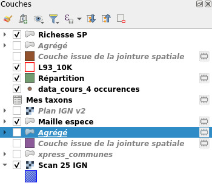

# Découverte de QGIS

QGIS est un logiciel SIG (Système d'Information Géographique). Le compréhension du principe de base est importante pour bien utiliser le logiciel : Vous ne l'utilisez PAS pour dessiner des cartes, vous l'utilisez (entre autres) pour définir des règles permettant de **générer** des cartes. La nuance est importante.

## Structure des projets

Le fichier principal est le fichier **projet** *(mon-projet.qgs* ou *mon-projet.qgz*). Ce fichiers indique notamment quelles **sources de données** utiliser, et quels **styles** leur appliquer.
Il est important de bien garder en tête que ce fichier ne contient **pas** directement les données.

La source de données est votre information abstraite, et les styles sont la manière dont vous allez représenter cette information.

### L'interface

QGIS va vous permettre d'ouvrir et **supperposer** plusieurs couches.

L'ordre des couches dans la liste représente l'ordre dans lequelle elles sont superposées sur la carte (l'oeil étant positionné en haut).

Pour chaque couche on a donc :
- Une source de données
- Un style

### Le style

Le style est un ensemble de règles simples ou complexes, qui vont permettre de définir comment **représenter** les données.
Symbologie, formulaires, champs virtuels

